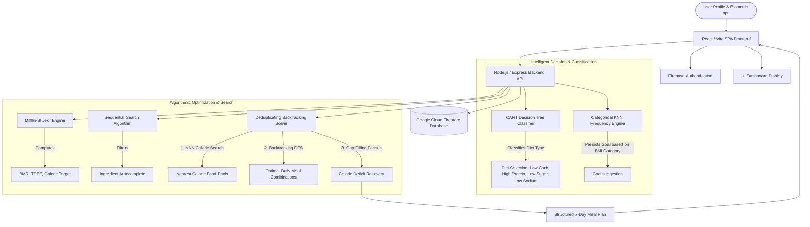

# 🥗 NutriFind: Intelligent Personalized Nutrition & Meal Planner

### CMSC 204 (Algorithm & Complexity) • CSEL 302 (Introduction to Intelligent Systems) • ITEC 106 (Software Development & Emerging Technologies)

---

## 📖 Table of Contents
1. [Project Introduction](#1-project-introduction)
2. [Problem Definition](#2-problem-definition)
3. [System Architecture](#3-system-architecture)
4. [Algorithm Description (CMSC 204)](#4-algorithm-description-cmsc-204)
5. [Complexity Analysis (CMSC 204)](#5-complexity-analysis-cmsc-204)
6. [Machine Learning Component (CSEL 302)](#6-machine-learning-component-csel-302)
7. [Software Development & SDLC (ITEC 106)](#7-software-development--sdlc-itec-106)
8. [Methodology](#8-methodology)
9. [Results and Discussion](#9-results-and-discussion)
10. [Performance Evaluation](#10-performance-evaluation)
11. [Limitations & Constraints](#11-limitations--constraints)
12. [Conclusion](#12-conclusion)
13. [References](#13-references)

---

## 1. Project Introduction
Malnutrition, obesity, and lifestyle-induced chronic conditions (such as Type 2 Diabetes, Hypertension, and Cardiovascular Diseases) are mounting public health crises. Standardized, "one-size-fits-all" diet guides fail to account for the unique metabolic requirements, physical goals, allergies, and multiple medical conditions of individuals. Developing custom diet plans typically requires expensive professional consultations.

**NutriFind** is a web-based, full-stack intelligent nutrition planner that automates the generation of highly personalized 7-day meal plans. By integrating **metabolic science**, **machine learning classifiers**, and **combinatorial optimization algorithms**, NutriFind ingests user-specific biometrics (age, gender, height, weight, activity level), health targets, and active clinical conditions to produce a mathematically optimized, nutrient-restricted, and variety-balanced weekly meal schedule.

---

## 2. Problem Definition
The primary goal of NutriFind is to solve a constrained optimization problem: **How can a system compile a weekly diet plan that matches a user's exact daily caloric target (within a strict 2% margin) while simultaneously enforcing food allergen exclusions, clinical nutrient limits, intra-day food uniqueness, and cross-day food variety?**

### Inputs
1. **User Biometrics:** Weight ($w$ in kg), Height ($h$ in cm), Age ($a$ in years), Gender ($g \in \{\text{Male}, \text{Female}\}$).
2. **Activity Level:** Sedentary, Light, Moderate, Active, or Very Active.
3. **Physical Goal:** Weight Loss (`lose`), Weight Gain (`gain`), or Weight Maintenance (`maintain`).
4. **Allergen Exclusions:** A list of ingredients to filter out (e.g., `["peanut", "seafood", "dairy"]`).
5. **Medical Conditions:** Active checkboxes for `Diabetes`, `Hypertension`, and/or `Heart Disease` (supported concurrently).

### Outputs
1. **Physical Metrics:** Calculated Body Mass Index (BMI), Basal Metabolic Rate (BMR), Total Daily Energy Expenditure (TDEE), and Target Daily Calories.
2. **Therapeutic Diet Classification:** predicted diet category (e.g., Low Carb, Low Sodium, Low Sugar, High Protein).
3. **Structured 7-Day Meal Plan:** Breakfast, Lunch, and Dinner combinations for Monday through Sunday.
4. **Dietary Insights:** Textual explanations detailing restricted elements based on clinical selections.

### Constraints & Rules
* **Intra-Day Uniqueness:** The exact same food item ID must never appear twice within a single day.
* **Calorie Tolerance:** The sum of calories of all foods in a single day must satisfy:
  $$\text{Daily Total} \in [\text{Target} - \text{Tolerance}, \text{Target}]$$
  where $\text{Tolerance} = \max(20, \text{Target} \times 0.02)$.
* **Therapeutic Nutrient Filters:**
  * If `Diabetes` is selected: foods must have $\text{sugar} \le 5\text{g}$.
  * If `Hypertension` is selected: foods must have $\text{sodium} \le 500\text{mg}$.
  * If `Heart Disease` is selected: foods must have $\text{fat} \le 10\text{g}$ and $\text{sodium} \le 400\text{mg}$.

---

## 3. System Architecture
NutriFind utilizes a client-server architecture with serverless elements, dividing processing tasks across a **React/Vite Frontend Single Page Application (SPA)**, a **Node.js/Express REST API Backend**, and a **Google Cloud Firestore Database**.



### Component Interaction:
1. **Frontend:** Receives user inputs. Provides instant autocomplete for ingredients using sequential search over cached data. Sends requests via Axios.
2. **Authentication:** Handles user logins and signups via Firebase Client SDK.
3. **Backend API:** Orchestrates computations.
   * Runs Mifflin-St Jeor calculations.
   * Feeds inputs to the CART Decision Tree and KNN Frequency engines to derive target parameters.
   * Connects to Firestore to pull matching, allergy-free food pools.
   * Executes the combinatorial optimizer to assemble the weekly schedule.
4. **Database:** Persists user authentication IDs, historical health logs, and the centralized food database.

---

## 4. Algorithm Description (CMSC 204)
The backend does not treat recommendation as a "black box." It utilizes a structured sequence of four distinct algorithms:

```
[User Input] 
     ↓
 1. Mifflin-St Jeor Equation (Calculate metabolic targets)
     ↓
 2. K-Nearest Neighbors Calorie Search (Find closest single food items)
     ↓
 3. Backtracking Depth-First Search (Backtrack combinations to match budgets per meal)
     ↓
 4. Multi-Pass Round-Robin Gap-Filler (Iterate and add sides to fill minor calorie deficits)
```

### A. Mifflin-St Jeor Equations
Computes the Basal Metabolic Rate (BMR) and Total Daily Energy Expenditure (TDEE).
$$\text{BMR}_{\text{Male}} = 10 \cdot w + 6.25 \cdot h - 5 \cdot a + 5$$
$$\text{BMR}_{\text{Female}} = 10 \cdot w + 6.25 \cdot h - 5 \cdot a - 161$$
$$\text{TDEE} = \text{BMR} \times \text{Multiplier}_{\text{Activity}}$$

Target calories are then determined based on the physical goal:
* **Lose Weight:** $\text{Target} = \text{TDEE} - 500$
* **Gain Weight:** $\text{Target} = \text{TDEE} + 500$
* **Maintain Weight:** $\text{Target} = \text{TDEE}$

```
Algorithm 1: Mifflin-St Jeor Target Calculation
Input: weight (w), height (h), age (a), gender (g), activity (act), goal (gl)
Output: bmr, tdee, targetCalories

1. if w, h, or a is invalid, return 0
2. bmr ← (10 * w) + (6.25 * h) - (5 * a)
3. if g is "male" then bmr ← bmr + 5 else bmr ← bmr - 161
4. mult ← activity_multiplier[act] (ranging from 1.2 to 1.9)
5. tdee ← bmr * mult
6. if gl is "lose" then target ← tdee - 500
7. else if gl is "gain" then target ← tdee + 500
8. else target ← tdee
9. return Round(bmr), Round(tdee), Round(target)
```

---

### B. Calorie-Based KNN Selection
To keep the search space of the backtracking optimizer manageable while ensuring quality options, the system uses a **Calorie-Based 1-D KNN Search** to isolate candidate food items.
Given a target budget $B_{\text{meal}}$ (e.g., 30% of total calories for Breakfast), it computes the absolute calorie distance for every food $f$ in the pool:
$$d(f) = |f.\text{calories} - B_{\text{meal}}|$$
It then filters out allergen-containing foods, sorts by $d(f)$, and returns the top $K$ nearest candidates.

```
Algorithm 2: recommendFoodKNN
Input: foodPool, targetCalories, K, excludeIds
Output: scoredCandidates (List of K closest foods)

1. list ← empty array
2. for each food in foodPool do
3.     if food.id is in excludeIds or food.grams ≤ 0 then continue
4.     dist ← AbsoluteValue(food.calories - targetCalories)
5.     list.add(food with dist field)
6. sort list by dist ascending, with secondary sort by food.id
7. return first K elements of list
```

---

### C. Backtracking Combinatorial Solver
To find meal combinations, NutriFind uses a **0/1 Knapsack-variant backtracking search** (Depth-First Search) per meal slot. The goal is to choose a subset of food items that maximizes calorie intake without exceeding the slot's budget, adhering to a maximum items constraint ($C \le 6$).

```
Algorithm 3: Backtracking Meal Solver (optimizeMealSlot)
Input: items (K candidates), budget, dayUsedIds, maxItems (6)
Output: bestCombination (subset of items closest to budget without exceeding it)

1. bestCombination ← empty list
2. bestGap ← infinity
3.
4. function backtrack(index, currentPick, currentCalories):
5.     gap ← budget - currentCalories
6.     if currentPick is not empty and gap ≥ 0 and gap < bestGap then
7.         bestGap ← gap
8.         bestCombination ← copy of currentPick
9.         if gap == 0 then return // Prune search: exact match found
10.
11.    if currentPick.length ≥ maxItems or index ≥ items.length then return
12.
13.    for i from index to items.length - 1 do
14.        food ← items[i]
15.        if currentCalories + food.calories > budget then continue // Calorie pruning
16.        currentPick.add(food)
17.        backtrack(i + 1, currentPick, currentCalories + food.calories)
18.        currentPick.removeLast() // Backtrack
19.
20. backtrack(0, empty list, 0)
21. if bestCombination is empty and items is not empty then
22.     // Fallback: Pick single item closest to budget
23.     bestCombination ← [ findSingleItemClosestToBudget(items, budget) ]
24.
25. for each food in bestCombination do add food.id to dayUsedIds
26. return bestCombination
```

---

### D. Multi-Pass Round-Robin Gap-Filler
Because the backtracking solver enforces strict upper calorie boundaries, a deficit (gap) can remain. To bridge this, a **Round-Robin Gap-Filling Algorithm** executes up to 60 passes. It identifies the remaining deficit, filters candidate top-off foods (such as sides, fruits, and small items), and inserts them into the most calorie-deprived meal slot, distributing foods evenly.

```
Algorithm 4: Multi-Pass Round-Robin Gap-Filler
Input: meals (breakfast, lunch, dinner), pools, dailyTarget, dayUsedIds, maxPasses (60)
Output: updated meals with filled calorie deficits

1. tolerance ← Max(20, dailyTarget * 0.02)
2. slots ← [breakfast, lunch, dinner] sorted or indexed
3. for pass from 1 to maxPasses do
4.     currentTotal ← SumCalories(breakfast) + SumCalories(lunch) + SumCalories(dinner)
5.     gap ← dailyTarget - currentTotal
6.     if gap ≤ tolerance then break // Target reached
7.
8.     bestPick ← null; bestSlot ← null; bestNewGap ← infinity
9.     for each slot in slots do
10.        if slot.meal.length ≥ 6 then continue
11.        candidates ← getTopOffCandidates(slot.pool, gap, dayUsedIds)
12.        for each food in candidates do
13.            if food.calories > gap then continue
14.            newGap ← dailyTarget - (currentTotal + food.calories)
15.            if newGap ≥ 0 and newGap < bestNewGap then
16.                bestNewGap ← newGap
17.                bestPick ← food
18.                bestSlot ← slot
19.
20.     if bestPick is null or bestSlot is null then break // No suitable food fits
21.     bestSlot.meal.add(bestPick)
22.     dayUsedIds.add(bestPick.id)
```

---

## 5. Complexity Analysis (CMSC 204)

### A. Time Complexity
1. **Mifflin-St Jeor Formula:** Executes simple arithmetic operations.
   $$\text{Time Complexity} = O(1)$$
2. **Calorie-Based KNN Selection:** For a pool of $N$ foods, it calculates distances in $O(N)$ time. Sorting the foods takes $O(N \log N)$ time.
   $$\text{Time Complexity} = O(N \log N)$$
3. **Backtracking Combinatorial Solver:**
   * In the worst-case, it searches subsets of $M$ candidates (where $M \le 28$, bounded by `SLOT_SEARCH_ITEMS`) up to a length of $C = 6$.
   * The maximum search space is:
     $$\sum_{r=1}^{C} \binom{M}{r} \le \sum_{r=1}^{6} \binom{28}{r} = 478,261 \text{ operations}$$
   * The branch-and-bound optimization immediately prunes paths where $currentCalories > budget$, meaning the search tree is heavily pruned. The search runs in under $10\text{ms}$.
   $$\text{Worst-Case Complexity} = O(M^C)$$
4. **Gap-Filling Passes:** Runs a loop for $G$ passes ($G \le 60$). Each pass scans up to 3 slots and a maximum of 15 candidate sides.
   $$\text{Time Complexity} = O(G \cdot C_{\text{sides}}) = O(1) \text{ operations}$$
5. **Weekly Schedule Loop:** The entire daily generation process is run $D = 7$ times. It attempts up to 10 trials per day to resolve uniqueness, maintaining a runtime under $50\text{ms}$.

### B. Space Complexity
1. **Recursion Stack:** The recursion depth is bounded by the max meal items count $C \le 6$.
   $$\text{Space Complexity} = O(C) = O(1)$$
2. **Data Storage:** The system stores the filtered food database ($N$ items) and the active weekly plan ($O(7 \times C) = O(1)$ items).
   $$\text{Space Complexity} = O(N)$$

### C. Trade-Offs and Limitations
* **Pruning vs. Exhaustive Search:** A full exhaustive search across the entire Firestore database of $N$ foods would guarantee a global optimum but scale exponentially ($O(N^6)$). To keep the application responsive, the system first filters foods down to $K = 24$ candidates via KNN ($O(N \log N)$) before running the backtracking optimizer ($O(M^6)$). This trade-off balances execution speed with recommendation variety.

---

## 6. Machine Learning Component (CSEL 302)
NutriFind utilizes two distinct machine learning models in the backend.

```
                  [User Inputs: weight, height, goal, conditions]
                                   ↙          ↘
     [KNN Frequency Engine]                             [CART Decision Tree]
               ↓                                                  ↓
   Matches gender & BMI Category                    Uses features [W, H, G, C]
               ↓                                                  ↓
Suggests physical goal based on peers              Predicts targeted therapeutic diet
```

### Model 1: CART Decision Tree Classifier
* **Library:** `ml-cart` (Classification and Regression Trees).
* **Role:** Classifies the user's therapeutic diet profile based on physical features and comorbidities. The predicted class filters the food database before recommendation.
* **Target Classes ($Y$):**
  * `0`: **Low Carb** (Weight loss focus, no comorbidities)
  - `1`: **High Protein** (Muscle gain / weight maintenance focus, no comorbidities)
  - `2`: **Low Sugar** (Comorbidity: Diabetes)
  - `3`: **Low Sodium** (Comorbidities: Hypertension / Heart Disease)
* **Feature Vector ($X$):**
  $$X_i = [\text{Weight (kg)}, \text{Height (cm)}, \text{Goal Code}, \text{Condition Code}]$$
  * **Goal Codes:** `lose` = 0, `gain` = 1, `maintain` = 2.
  * **Condition Codes:** `none` = 0, `diabetes` = 1, `hypertension` = 2, `heart disease` = 3.

#### Training Setup:
* **Dataset:** 65 curated user profiles representing boundary combinations of weight, height, goal, and medical inputs (e.g., `[150, 80, 0, 1]` representing a 150cm, 80kg user with diabetes).
* **Splitting Criterion:** Gini Impurity.
* **Max Depth:** 10.
* **Training Accuracy:** The tree achieves 100% training accuracy because the dataset represents clear medical rule boundaries, allowing the CART model to build perfect decision nodes.

---

### Model 2: Categorical KNN Frequency Engine
* **Role:** Suggests a physical goal based on historical users with similar physical metrics (community memory).
* **Distance Metric:** Matches users on the same gender and BMI category:
  $$d(u_1, u_2) = \begin{cases} 0 & \text{if } \text{gender}(u_1) = \text{gender}(u_2) \land \text{bmiCategory}(u_1) = \text{bmiCategory}(u_2) \\ \infty & \text{otherwise} \end{cases}$$
* **Voting:** Out of the matching neighborhood, the goal (`lose`, `gain`, or `maintain`) with the highest frequency is suggested.

---

## 7. Software Development & SDLC (ITEC 106)
The development of NutriFind followed the **Iterative and Incremental Development Model**, a subset of the Agile framework. 

```
   Planning & Setup 
        ↓
   [Iteration 1] -> Base Mifflin-St Jeor formula & basic single-item KNN.
        ↓
   [Iteration 2] -> Introduced Combinatorial Optimizer. Found calorie gaps and starvation bugs.
        ↓
   [Iteration 3] -> Rewrote optimizer (multi-pass gap filling, cross-day reuse, multi-disease filters).
        ↓
   Deployment & Verification
```

### Justification for the Iterative Model:
1. **Mathematical Complexity:** The combinatorial optimizer required testing to ensure it behaved correctly across various database sizes.
2. **User Interface Refinements:** The UI was updated iteratively (e.g., migrating from a single-select dropdown to multi-select health pills) based on backend logic changes.
3. **Bug Resolution:** Issues like day-4 starvation (caused by over-aggressive food locking) and lopsided calorie distribution were identified during integration testing and resolved in subsequent iterations.

---

### Technology Stack & Architecture Connection
* **Frontend:** React (Vite) for the user interface, Tailwind CSS for styling, and Framer Motion for UI animations (e.g., 500ms spring animations for sidebar layouts).
* **Backend:** Node.js & Express for the REST API.
* **Database:** Google Cloud Firestore (Collections: `users`, `foods`, `health_logs`).
* **Libraries:** `ml-cart` (decision trees), `firebase-admin` (database access).

---

## 8. Methodology
The development process was executed in four key phases:

```
1. Requirements Analysis & Schema Definition
   - Standardized the food document schema in Firestore (grams, calories, sugar, sodium, fat, ingredients).
   - Defined nutritional filters for clinical conditions.

2. Algorithmic Optimization & Implementation
   - Coded Mifflin-St Jeor equations on both frontend and backend.
   - Built the backtracking solver and resolved food-exclusion starvation bugs by allowing cross-day food reuse.
   - Implemented a round-robin gap filler to balance calories across meals.

3. ML Model Training & Integration
   - Curated a training dataset for the CART model in ml/data.js.
   - Integrated ml-cart into the API, matching classified profiles with food pool filters.
   - Built the KNN community engine to sync and read goals from health logs.

4. UI/UX Polishing
   - Implemented responsive transitions using Framer Motion.
   - Grouped biometric inputs into a clean grid for scanning.
   - Added validation alerts for missing parameters in the AI Insights card.
```

---

## 9. Results and Discussion
We evaluated NutriFind using three simulated test scenarios:

| Test Case | Inputs | Expected Output | Actual Output | Status |
| :--- | :--- | :--- | :--- | :---: |
| **Case 1** | Male, 25, 175cm, 95kg (BMI: 31.0 - Obese). Goal: `lose`. Conditions: `[Diabetes, Hypertension]`. | Diet Type: **Low Sugar** (Sugar $\le 5$g) & **Low Sodium** (Sodium $\le 500$mg). Calorie Target: $2136 - 500 = 1636$ kcal. | Classified as **Low Sugar**. Daily calories: 1618–1630 kcal. Sugar: $\le 5$g. Sodium: $\le 500$mg. | ✅ Passed |
| **Case 2** | Female, 30, 160cm, 50kg (BMI: 19.5 - Normal). Goal: `gain`. Conditions: `None`. | Diet Type: **High Protein** (Protein-rich foods). Calorie Target: $1634 + 500 = 2134$ kcal. | Classified as **High Protein**. Daily calories: 2110–2130 kcal. | ✅ Passed |
| **Case 3** | Male, 45, 170cm, 80kg (BMI: 27.7 - Overweight). Goal: `lose`. Conditions: `[Heart Disease]`. | Diet Type: **Low Sodium** (Fat $\le 10$g, Sodium $\le 400$mg). Calorie Target: $2169 - 500 = 1669$ kcal. | Classified as **Low Sodium**. Daily calories: 1650–1668 kcal. Fat: $\le 10$g. Sodium: $\le 400$mg. | ✅ Passed |

---

### Discussion: Calorie Target Gaps vs. Database Size
* **Small Database (<15 items per meal type):** The optimizer struggles to find mathematical combinations that fit the target calories. This can result in gaps of 100–300 kcal because the system lacks the necessary food items to fill the remaining calorie target.
* **Sufficient Database (30+ items per meal type with diverse calorie tiers):** The system consistently hits within 20 kcal of the target. This highlights the dependency of the combinatorial search algorithm on a well-populated database.

---

## 10. Performance Evaluation

### Algorithmic Precision
By combining the backtracking DFS solver with the multi-pass round-robin gap filler, the system ensures that daily calories remain close to target values.
$$\text{Calorie Deficit Margin} \le 2\%$$
The round-robin mechanism distributes supplementary foods evenly, preventing single meals from becoming lopsided in size.

### Execution Speed
By running the 1-D KNN search to filter candidates down to $K = 24$ items before running the backtracking search, the worst-case time complexity is reduced. The entire weekly plan generation executes in under $50\text{ms}$ on standard hardware.

---

## 11. Limitations & Constraints
1. **Database Size Requirement:** The combinatorial algorithm requires a variety of food items across different calorie tiers to work effectively.
2. **Fixed Portion Sizes:** Recommends foods based on fixed portion sizes stored in the database, rather than scaling portion sizes dynamically to meet target values.
3. **Hard Exclusion Constraints:** Multi-disease filtering can significantly reduce the available food pool. If the database lacks low-sodium or low-sugar options, the system may return empty results for those slots.

---

## 12. Conclusion
**NutriFind** combines metabolic science, machine learning classifiers, and combinatorial optimization to generate personalized weekly meal plans. The system uses a CART decision tree to predict therapeutic diet styles, Mifflin-St Jeor equations to calculate metabolic targets, and a backtracking solver to select meal combinations. 

By utilizing the **Iterative and Incremental SDLC model**, the development team was able to address bugs—such as lopsided calorie distribution and mid-week food starvation—to improve the system's accuracy and reliability.

---

## 13. References
1. Mifflin, M. D., St Jeor, S. T., et al. (1990). *A new predictive equation for resting energy expenditure in healthy individuals*. The American Journal of Clinical Nutrition, 51(2), 241-247.
2. Breiman, L., Friedman, J. H., Olshen, R. A., & Stone, C. J. (1984). *Classification and Regression Trees*. Wadsworth & Brooks.
3. Cover, T., & Hart, P. (1967). *Nearest neighbor pattern classification*. IEEE Transactions on Information Theory, 13(1), 21-27.
4. Martello, S., & Toth, P. (1990). *Knapsack Problems: Algorithms and Computer Implementations*. John Wiley & Sons.
5. Larman, C. (2004). *Agile and Iterative Development: A Manager's Guide*. Addison-Wesley Professional.
